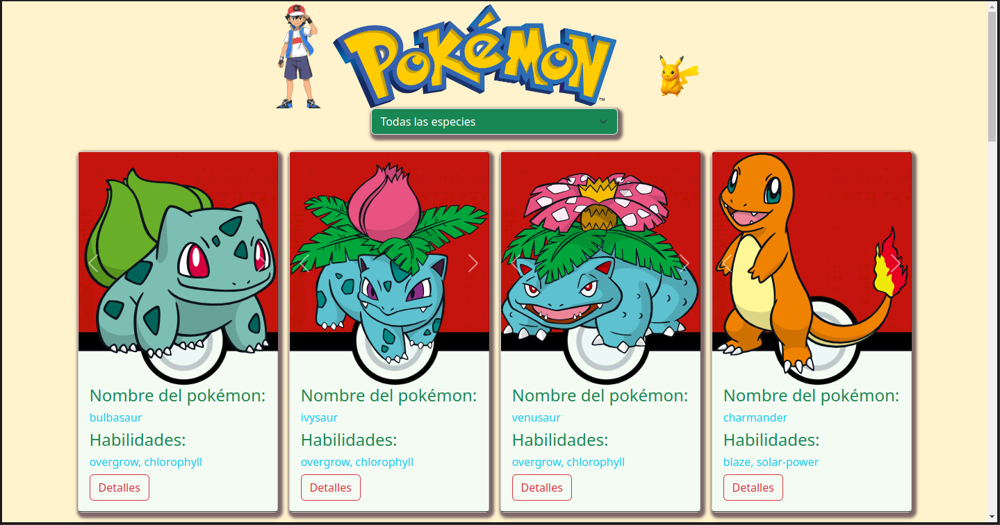
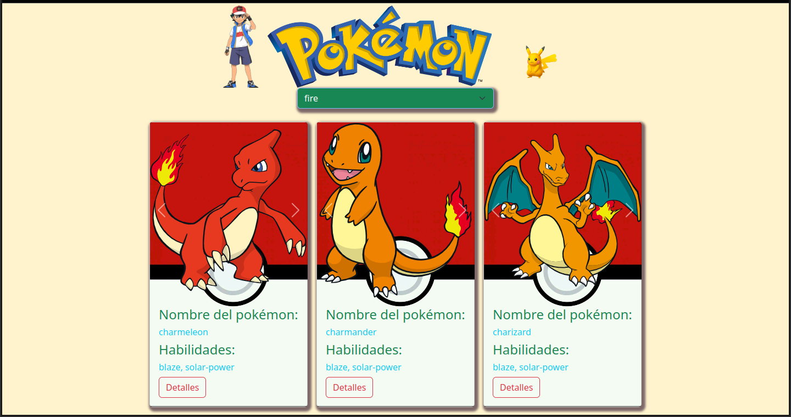
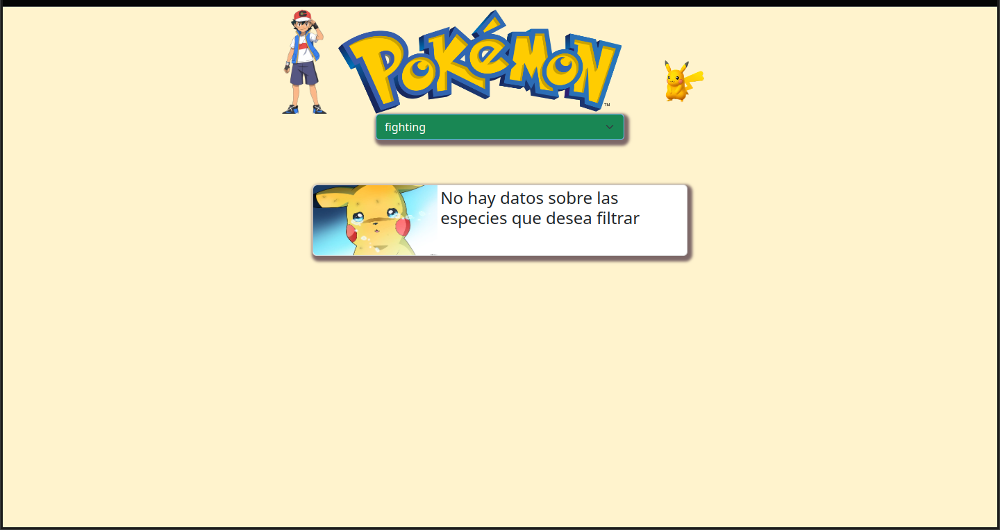

# uso del fetch
En este proyecto se hizo el uso del fetch, usando los servicios de pokeapi. Uso de muy buena logica en JavaScript con HTML y CSS. usando tambien el framework de Bootstrap. y filtrar los elementos conforme a nuestras necesidades es una parte que llevo un poco de tiempo pero la practica al final hizo que se facilitara.

